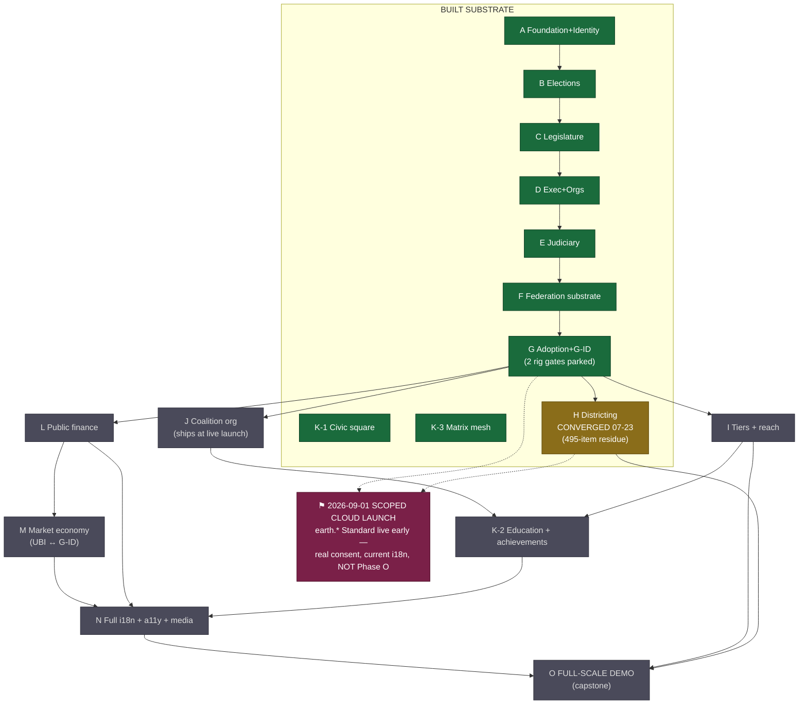

# Phase Ledger A → O — the complete recounting (2026-07-24)

Lane 7 companion to [DELTA_INVENTORY.md](DELTA_INVENTORY.md). One row per phase:
what it is, what actually shipped, status today. This is the §5 skeleton for
`CGA_Architecture_Plan_2026-07.docx`.

> **⚠ CORRECTED 2026-07-25 by the definitive code audit — [BUILT_INVENTORY.md](BUILT_INVENTORY.md).**
> The 14-agent audit overturned two status rows (I and K-2 are PARTIAL, not unbuilt) and six
> "absent" claims (journeys = the K-2 education plane; stipend params = live UBI parameter layer;
> CI-2 scale_demo rail already pinned; splitline shipped under F-ELB-008; factions-correction
> content live; public_records.translations = the dynamic-translation status store). Where this
> file and BUILT_INVENTORY.md disagree, **BUILT_INVENTORY.md wins**. Statuses below updated;
> per-phase remaining-scope lists live there (§3).

**Letter reconciliation** (three systems, one ledger): the institutions build used
letters A–E over "Phases 0–5" numbering (A ≈ 0–1 Foundation+Identity, B ≈ 2, C ≈ 3,
D ≈ 4, E ≈ 5); Phase F–G continued the letters; H–O are the charter's canonical
letters (`docs/plans/CGA_PHASE_G_AND_BEYOND_ROADMAP.md` — the exploration docs'
self-assigned letters are retired). K split into K-1/K-2/K-3 during the G
continuation.

## The ledger

| Ph | Name | Status 2026-07-24 | What shipped / what it is |
|----|------|-------------------|---------------------------|
| **A** | Foundation, Constitutional Engine, Identity (builds 0–1) | ✅ BUILT | Docker stack · Laravel 12 + Vue 3 + Inertia · ConstitutionalEngine + hash-chained `audit_log` · clocks + scheduler · activation engine · design system/AppShell · UUID users, GPS `location_pings`, residency confirmations, recursive ancestor-sweep associations, derived roles R-01→R-04 |
| **B** | Elections Engine (build 2) | ✅ BUILT | PROTECTED `VoteCountingService`: PR-STV/Droop/Gregory + single-winner RCV + universal countback · two-phase open ballot + commitment scheme · bootstrap election board · certification auto-seating |
| **C** | Legislature Operations (build 3) | ✅ BUILT | Peg-quorum chamber votes · bicameral dual agreement · Speaker (RCV supermajority) · committees (faction-independent assignment) · bills → versioned laws · referendums + petitions · emergency powers (CLK-03, 90-day ceiling) |
| **D** | Executive & Organizations (build 4) | ✅ BUILT | Exec delegation/conversion (dual supermajority) · departments + Boards of Governors (CLK-09, 10-yr) · executive orders w/ pre-issuance scope validation · full org module + hardened co-determination (CLK-13/14, 100→2000 thresholds) · board elections · CGC public-domain IP register |
| **E** | Judiciary & Law (build 5) | ✅ BUILT | Appointed/elected courts · equal-per-constituent nomination · cases/panels/juries/advocates · double jeopardy · Art. IV §5 three-path challenge ending in DIRECT judicial law-editing (`judicial_remedy` version, history preserved) |
| **F** | Federation substrate & versioned maps | ✅ BUILT | Peer mesh · Full Faith & Credit sync · authority flip (export bundle = seed) · CLK-20 · `jurisdiction_maps` boundary versioning · i18n machinery (loader, glossary, pseudo-locale, 5-locale chrome) |
| **G** | Federated adoption, earned autonomy, social mesh, G-ID | ✅ CODE-COMPLETE (`823e752`, 322 pins, 0 skips) · ⏳ 2 rig gates parked | Prong 1 volunteer mirror mesh (cold-sync→join-key→vouch→wizard) · Prong 2 earned autonomy (G-ID attestation, co-member clusters, write-routing, Patroni HA, fail-closed ballot re-wrap, autonomy vote) · parked: **G-V1** native Capacitor mobile w/ on-device GPS test (still device-gated) · **G-V2** real cross-machine peer onboarding — **PASSED 2026-07-25 via the operator's Pi test** (cross-machine join proven; the Azure fresh-box/multibox path is lane 2's remaining scale challenge) |
| **H** | Districting completion & planetary map generation | ✅ CONVERGED 2026-07-23 · residue in hand | Run 6: 520,553/521,050 sweeps + all 434,080 singles; **≈955,130 legislatures districted across ≈951,626 jurisdictions (≈1.96M districts — the runtime triple; lane 9 caught the earlier "951,626 legislatures" conflation 2026-07-25)**; Earth **1,999 seats EXACT** (282 districts), USA 702 EXACT; leaf giants line-split (no clamp stubs — 472k root-leaf splits); F-ELB-008 live (the automated splitline generator shipped and files under it; the F-ELB-007 form ID was never minted; F-ELB-009/exemplars/recalibration loop superseded by the settled scoring doctrine, never built); `district_subdivisions` + exactness law + seat-drift audit. Residue (lane 1): 495 review items (concave 426 hand-draw · monsters 8 solo retries · gap 28 · frag 20 · misc 13) + analysis round + **geodata pull engine build** (`docs/plans/etl/GEODATA_PULL_ENGINE_PLAN.md`) |
| **I** | Activation tiers & reach/legitimacy metric | ◐ **PARTIAL** (audit 2026-07-25) | **Built half:** the activation boot-gate is LIVE — `jurisdiction_activations` state machine, CLK-06 every-minute sweep, settings-cascade threshold (dev default 1), full WF-JUR-01 bootstrap, `jurisdiction:activate`, WI-9 UI status line; CLK-06 already tagged `per_jurisdiction_tier`; the Reach nav surface pre-registered. **Missing half:** the tier CURVE (`clamp(ceil(k·pop^⅓), floor, cap)` params + ActivationTierService) and the entire reach/legitimacy layer (`legitimacy_snapshots`, LegitimacyService, nightly snapshot, k-anon). **Provides Phase O's denominator.** (Sizing-law note: `cubeRootSeats` is legislature SIZING, a cousin — and its leaf ceiling-9 clamp was retired 2026-07-19, floor-clamp only) |
| **J** | Cosmopolitan Coalition as organization | ◻ UNBUILT (tiny; **last** in work order — ships when the live game opens) | Two nonprofits on the built Phase-D org module: **Cosmopolitan Party Foundation** (parent) + **Cosmopolitan Coalition of United Earth** (authoring child) — the same pair the 8a/8b websites represent · voluntary `public_domain_charter` (one-way) · Δ4 authorship bridge feeding K + N · strict civil-society firewall (Article-I levers only) |
| **K-1** | Civic record plane (public square + halls) | ✅ BUILT | Per-jurisdiction square + halls bound to governance objects · Art. I: the square **cannot be censored** — exactly four carve-outs (judicial order, rights-protection, per-user block, content-neutral anti-spam) · F-SOC-001..003 forms live (F-CHR-* are the committee-CHAIR forms — prior family attribution corrected 2026-07-25) |
| **K-3** | Matrix mesh commons | ✅ BUILT | Synapse + MAS + LiveKit voice, appservice-bridged to K-1 · illegal-content layer kept OFF the constitutional plane |
| **K-2** | Civic education + achievements | ◐ **PARTIAL** (audit 2026-07-25) | **Achievements half BUILT** (shipped as mockups-v3-wiring Phase 3c, never attributed): journeys engine (13 arcs, 10 live) + `journey_progress` + append-only `achievements` (DB-trigger enforced) + code-registry catalog (`config/cga/journeys.php`) + profile badges + cross-instance medal federation (own constitutional test). **Missing half:** graded education modules (questions/correct_keys/server grading), F-EDU forms, curriculum extraction (**The_Chart.drawio is the map**), Learn-module packaging of the **factions→polymorphic correction** (correction copy already live across built surfaces), and the I-gated reach gauge/leaderboards. Lane 15's engine work starts from `JourneyService`, NOT greenfield |
| **L** | Public finance | ✅ **BUILT 2026-07-25** (lane 13; 600 passed / 0 regressions) | Double-entry hash-chained public ledger (`LedgerService` sole writer) · revenue/levies (filings private) · budgets → existing appropriations · borrowings · **currency reserved to root** (Art. V §5) · no-paywall-on-civic-rights pin (Art. II §8) · F-LEG-037..040, F-TRE-001..003 |
| **M** | Market economy | ✅ **BUILT 2026-07-25** (lane 13, same wave as L) | Labor board (hires feed co-determination) · marketplace · mutual aid · **UBI: eligibility = active residency ONLY**, public aggregate + private receipts, never federated · sybil defense rides G-ID · F-TRE-004, F-IND-018..023, F-ORG-008 |
| **N** | Full i18n + accessibility + media (second-to-last) | ◻ UNBUILT (machinery live from F; lane 5 is its front-runner) | Extract ~90% hardcoded body copy across 64 pages/48 components → CI-gated catalogs · 115 registered locales / 77+ languages via local-NLLB + Haiku router · WCAG 2.2 AA + EN 301 549 · video→translated-video + `MultiTrackPlayer.vue` · glossary terms + ID tokens byte-identical in every locale · localizes EVERYTHING H–M before the demo |
| **O** | The full-scale demo (capstone — last) | ◻ UNBUILT (lane 4 is its design front-runner) | Two physically separate instances: `earth.*` **the Standard** (real multiplayer, dormant scaffolding, zero synthetic data) vs `earth-demo.*` **the Attained** (~8B synthetic world, `instance_class='scale_demo'` FORCES federation off, ephemeral copy-on-write sandbox, `DemoPopulateService` drives engine statics so demo math == engine math) · gated on H (map) + I (denominator) + N (localization) |

**Score (corrected 2026-07-25): 10 verified built** (A–G, H-converged, K-1, K-3) · **2 partial** (I, K-2) · **5 substrate-only** (J, L, M, N, O — none zero-trace; per-phase substrate lists in [BUILT_INVENTORY.md §3](BUILT_INVENTORY.md)).

## The chart

**Standing work order** (operator, 2026-06-19): **H → L+M → I → K-2 → N → O → J**.
**Overlay** (operator, 2026-07-23): the 40-day scoped cloud launch jumps the queue —
`earth.*` the Standard goes live by 2026-09-01 with real consent, current i18n, and
provisionable institutions; L/M, K-2, full N, and O stay on the long arc.

## The two drawio authorities (now reconciled at census level)

**`The_Chart.drawio`** (549 distinct labels): the **principles + curriculum map** —
A Fair Constitution decomposed into teaching Units → Lessons → Chapters per section
(Preamble, I Individuals, II.2/II.4/II.5/II.6/II.9, III.6, IV.4, V.2/V.4/V.5/V.7,
VI.3 …) with weight percentages per unit. It is **Phase K-2's content source** and
the sites' Learn-layer skeleton. Action: full label-level reconciliation (incl.
faction-language sweep, T-1) belongs to the K-2 authoring pass — not blocking any
current lane.

**`App_Flows.drawio`** (WIP per CLAUDE.md): the pre-build flow sketchbook. Largely
superseded by the shipped 108-form registry and the 80 WF-* walkthroughs (inverted
into the v3 Learn layer). Concept status **corrected by the 2026-07-25 audit**
([BUILT_INVENTORY.md §4](BUILT_INVENTORY.md)): Apply for Grants = **PARTIAL, half
shipped in Phase D** (apply route + UI live; award/disburse dead code) · Fund
Distribution = **exists** (appropriations-by-act pipeline; only donation-intake
fundraising is absent → fold that half into L/M) · Equal Partnership = implemented
org structure, only a formation flow missing · truly absent: Family Tree · Asset
Registration · Endorse Policies (`policy_proposals` is a false cognate — Phase D
department-internal F-EXE-002; the `endorsements` table is candidate-only, so this
needs new schema). Operator disposition still wanted on the three absent concepts.

## Where each ledger row lands next

- Rows A–H, K-1, K-3 → the "as-built" half of `CGA_Architecture_Plan_2026-07.docx` §5.
- Rows I–O → its forward half, quoting the charter's theses + exit criteria.
- The whole table (plain-language edition) → `docs/findings/FINDINGS_DIGEST.md`
  "Where the build stands" section for the site chats.
- The mermaid chart → the docx as a rendered figure + the digest as-is (GitHub
  renders mermaid at the raw/blob view's rendered mode; sites get the table).
